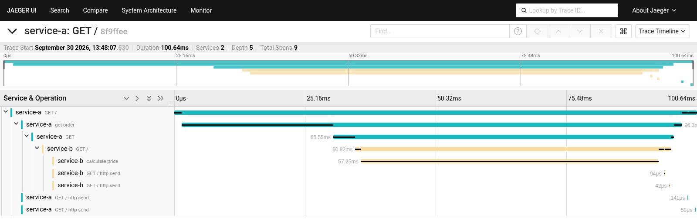

# Задание 3.1. Трейсинг с OpenTelemetry и Jaeger

Два сервиса на Python и FastAPI:

- service-a - сервис заказов, `GET /` возвращает заказ и за стоимостью обращается в service-b;
- service-b - сервис расчёта, `GET /` считает стоимость заказа.

OpenTelemetry SDK настроен в коде сервисов: автоинструментация FastAPI и httpx, собственные спаны `get order` и `calculate price` с атрибутами `order.id` и `model.polygons`. Спаны уходят по OTLP/HTTP в коллектор Jaeger. Контекст передаётся в service-b заголовком `traceparent`, поэтому вызов обоих сервисов попадает в один трейс.

| Путь | Содержимое |
| :- | :- |
| [services/service-a](services/service-a) | Код, зависимости и Dockerfile service-a |
| [services/service-b](services/service-b) | Код, зависимости и Dockerfile service-b |
| [k8s/jaeger-instance.yaml](k8s/jaeger-instance.yaml) | Экземпляр Jaeger |
| [k8s/services.yaml](k8s/services.yaml) | Деплойменты и сервисы. Добавлены переменные `OTEL_SERVICE_NAME`, `OTEL_EXPORTER_OTLP_ENDPOINT` и адрес service-b |
| [task3-1-jaeger-trace.png](task3-1-jaeger-trace.png) | Скриншот трейса в Jaeger UI |

## Запуск

Нужны Minikube, kubectl и Docker. Команды выполняются из каталога `Task3`.

```shell
minikube start --addons=ingress

kubectl apply -f https://github.com/cert-manager/cert-manager/releases/download/v1.13.3/cert-manager.yaml
kubectl -n cert-manager rollout status deploy/cert-manager-webhook

kubectl create namespace observability
kubectl create -f https://github.com/jaegertracing/jaeger-operator/releases/download/v1.51.0/jaeger-operator.yaml -n observability
# образа gcr.io/kubebuilder/kube-rbac-proxy:v0.13.1 больше нет в реестре, берём тот же образ из quay.io
kubectl -n observability set image deploy/jaeger-operator kube-rbac-proxy=quay.io/brancz/kube-rbac-proxy:v0.13.1
kubectl -n observability rollout status deploy/jaeger-operator
kubectl apply -f k8s/jaeger-instance.yaml

minikube image build -t service-a:latest services/service-a/
minikube image build -t service-b:latest services/service-b/
kubectl apply -f k8s/services.yaml
```

## Проверка

Вызов service-a, который вызывает service-b:

```shell
kubectl exec -it $(kubectl get pods -l app=service-a -o jsonpath='{.items[0].metadata.name}') -- wget -qO- http://service-a:8080
```

Ответ:

```json
{"order_id":26144,"status":"SUBMITTED","price":{"order_id":26144,"polygons":429177,"price":21458.85}}
```

Jaeger UI:

```shell
kubectl port-forward svc/simplest-query 16686:16686
```

Открыть http://localhost:16686, выбрать сервис service-a и нажать Find Traces.

## Результат

В трейсе 9 спанов двух сервисов: входящий запрос в service-a, спан `get order`, исходящий HTTP-вызов, входящий запрос в service-b и спан `calculate price`.


