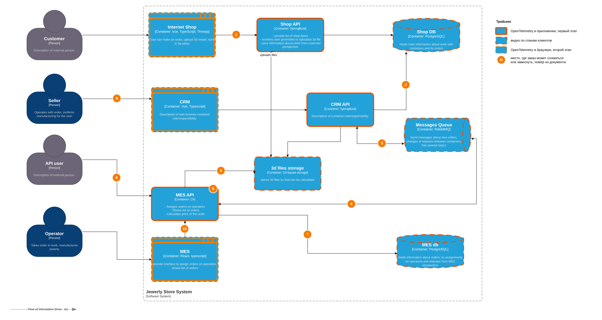
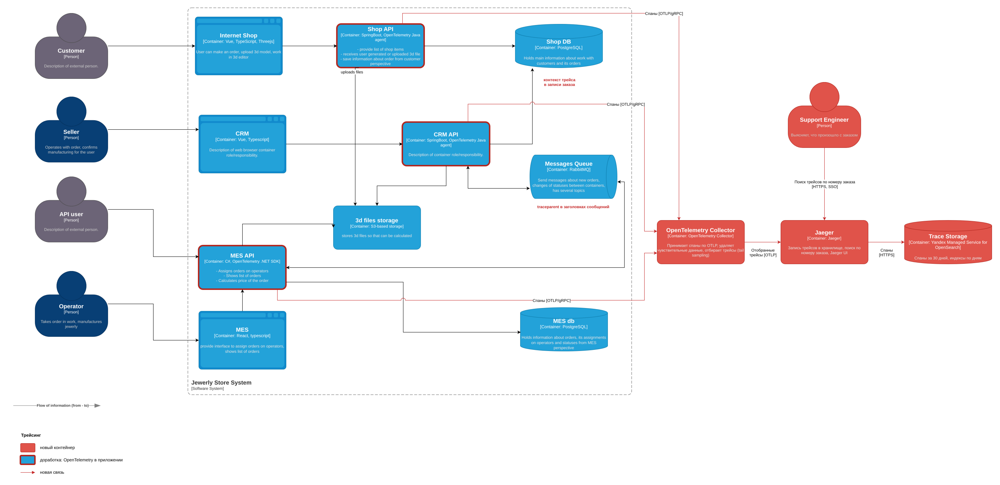
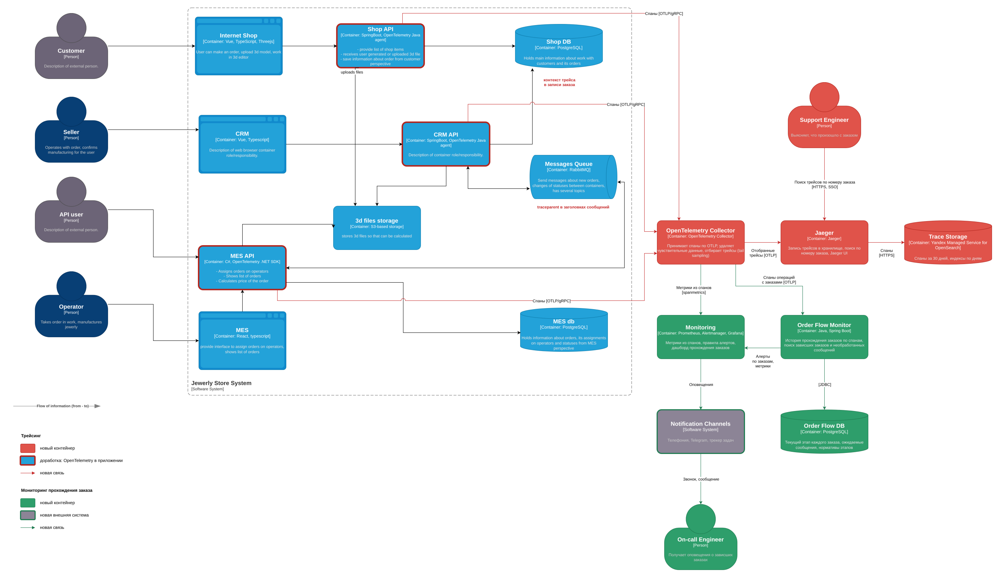

# Архитектурное решение по трейсингу

## Анализ системы

### Где заказ может сломаться или зависнуть

Места отмечены номерами на схеме. Там же выделены системы, которые покрываются трейсингом.

Исходник: [task3-tracing-scope.drawio](task3-tracing-scope.drawio)

| № | Место | Что может произойти |
| :-: | :- | :- |
| 1 | Internet Shop и Shop API: оформление заказа и загрузка 3D-модели в S3 | Ошибка или таймаут при отправке заказа, долгая или оборванная загрузка большой модели. Заказ остаётся в INITIATED или FILE_UPLOADED, покупатель не понимает, оформлен ли заказ |
| 2 | CRM API забирает новый заказ из Shop DB | Заказ сохранён в статусе SUBMITTED, но CRM его не забрал: ошибка выборки или заказ не попал под условие поиска. В MES заказ не приходит, и о нём никто не знает |
| 3 | Обмен CRM API и RabbitMQ | Сообщение о новом заказе или подтверждении не опубликовано или потеряно. Входящее сообщение о расчёте или смене статуса не обработано, Shop DB не обновлена |
| 4 | Обмен MES API и RabbitMQ | Сообщение из CRM не обработано: потребитель упал, сообщение зациклилось на повторах или ушло в DLX. Исходящее сообщение о расчёте, заказе партнёра или смене статуса не отправлено |
| 5 | MES API загружает модель из S3 | Файл не найден или загрузка оборвалась, расчёт не начинается |
| 6 | Расчёт стоимости в MES API | Расчёт идёт от 2-3 до 30 минут, падает с ошибкой или прерывается перезапуском MES API. Заказ остаётся в SUBMITTED |
| 7 | MES API записывает результат в MES db | Ошибка записи или расхождение: статус в базе изменился, а сообщение не ушло, или наоборот |
| 8 | Партнёр отправляет заказ в MES API | Ошибки и таймауты MES API, повторные запросы партнёра создают дубли |
| 9 | Продавец подтверждает заказ в CRM | Ручной этап, заказ ждёт подтверждения днями. Если сообщение о заказе партнёра не дошло до CRM, подтверждать нечего |
| 10 | Оператор берёт заказ в работу в MES | Дашборд грузится медленно, заказ долго никто не берёт. Если подтверждение из CRM не дошло до MES, оператор заказ не увидит |

### Какие системы покрываются трейсингом

| Система | Как покрывается | Почему |
| :- | :- | :- |
| Shop API | OpenTelemetry Java agent, первый этап | Начало пути заказа магазина: оформление, загрузка модели, запись в Shop DB (места 1, 2) |
| CRM API | OpenTelemetry Java agent, первый этап | Передача заказов в MES, приём статусов, создание заказов партнёров (2, 3, 9) |
| MES API | OpenTelemetry .NET SDK, первый этап | Самое проблемное место: приём заказов партнёров, расчёт стоимости, обмен с CRM, дашборд (4-8, 10) |
| RabbitMQ | Спаны публикации и обработки в приложениях, контекст трейса в заголовках сообщений | Брокер сам спаны не отдаёт, но по спанам клиентов видно, когда сообщение опубликовано, сколько ждало в очереди и обработано ли (3, 4) |
| Shop DB, MES db | Спаны клиентов JDBC и Npgsql | Время и ошибки запросов, в том числе запроса списка заказов на дашборде (2, 7, 10) |
| 3d files storage | Спаны клиента S3 | Время и ошибки загрузки и чтения моделей (1, 5) |
| Internet Shop, CRM, MES | OpenTelemetry для браузера, второй этап | Время, которое видит пользователь, в том числе загрузка дашборда операторами. Откладывается, потому что заказы ломаются в основном на бэкенде и в обмене сообщениями |

## Данные в трейсинге

| Группа | Атрибуты | Зачем |
| :- | :- | :- |
| Ресурс, у каждого спана | `service.name` (shop-api, crm-api, mes-api), `service.version`, `deployment.environment` (dev, release, prod), `service.instance.id` | Какая система, версия и инстанс. Отличить prod от тестовых окружений, связать проблему с релизом |
| Спан | trace_id, span_id, parent_span_id, имя операции, время начала и окончания, длительность, статус (OK, ERROR) | Путь запроса через системы и где потрачено время |
| Ошибки | `exception.type`, `exception.message`, стек вызовов | Причина отказа |
| HTTP | `http.request.method`, `http.route`, `http.response.status_code`, `url.path` без параметров запроса, `client` (mes-ui, partner-api) | Какой вызов, от кого и с каким результатом |
| База данных | `db.system`, `db.name`, `db.operation`, таблица, текст запроса без значений параметров | Медленные и ошибочные запросы |
| Сообщения | `messaging.system` (rabbitmq), exchange, routing key, очередь, `messaging.operation` (publish, receive, process), `messaging.message.id`, номер повторной доставки, признак отправки в DLX | Сообщение опубликовано, получено, обработано или ушло в DLX, сколько ждало в очереди |
| Хранилище | bucket, ключ объекта, операция, размер | Загрузка и чтение моделей |
| Заказ | `order.id`, `order.status` (новый статус), `order.previous_status`, `order.channel` (shop, partner), `partner.id`, `customer.id` (внутренний идентификатор) | Поиск всех операций по номеру заказа, переходы статусов, отдельный взгляд на заказы партнёров |
| Расчёт стоимости | `model.polygons`, `model.size_bytes`, `price.calculation.result` (success, error, timeout), время ожидания начала расчёта | Почему расчёт идёт долго, как время зависит от сложности модели |
| Исполнитель | `seller.id`, `operator.id` (внутренние идентификаторы) | Кто и когда выполнил ручной шаг |

В трейсинг не попадают Ф. И. О., email, телефон и адрес покупателя, платёжные данные, содержимое моделей и тела запросов, токены и ключи API партнёров, значения параметров SQL-запросов.

## Мотивация

Сейчас положение заказа приходится восстанавливать по базам трёх систем и со слов клиента. Мониторинг покажет, что заказы где-то копятся, но не ответит, что случилось с конкретным заказом. Трейсинг связывает шаги одного заказа в разных системах: по номеру заказа видно, какие операции прошли, какая упала, какое сообщение опубликовано и не обработано, сколько времени заняли загрузка модели, ожидание расчёта и сам расчёт.

Что это даёт компании:

- поддержка отвечает покупателю или партнёру по номеру заказа за минуты и без разработчиков;
- разработчики сразу видят место и причину сбоя, а не собирают их по трём системам;
- потерянное сообщение видно по разрыву в трейсе: публикация есть, обработки нет;
- видно, из чего складывается время до расчёта стоимости. Это основа для выноса расчёта в отдельные воркеры и для оценки эффекта.

| Метрика | Тип | Сейчас | После внедрения |
| :- | :- | :- | :- |
| Доля заказов, выполненных в обещанный срок | Бизнес | Заказы выполняются месяцами | Растёт: зависший заказ находят в день сбоя, а не по жалобе |
| Число заказов партнёров, потерянных между MES и CRM | Бизнес | Не измеряется, партнёры жалуются ежедневно | Каждый разрыв виден по трейсу и исправляется, число стремится к нулю |
| Время ответа клиенту на вопрос «где мой заказ» | Бизнес | Дни, нужен разработчик | Минуты, отвечает поддержка по номеру заказа |
| Время обнаружения проблемы (MTTD) | Техническая | До жалобы клиента, дни и недели | Минуты, по ошибкам в трейсах и алертам |
| Время восстановления (MTTR) | Техническая | Долгий поиск причины по трём системам | Место и причина видны в трейсе, остаётся исправление |
| Время от оформления до расчёта стоимости по составляющим | Техническая | Не измеряется | Видно ожидание в очереди, загрузку модели и расчёт отдельно, понятно, что оптимизировать |

## Предлагаемое решение

### Технологии

- **OpenTelemetry** для инструментации. Открытый стандарт, поддерживает Java и .NET, передаёт контекст по W3C Trace Context. Не привязывает к конкретному хранилищу трейсов.
- **OpenTelemetry Collector** принимает спаны от всех систем. В нём удаляются чувствительные данные и принимается решение, какие трейсы сохранять.
- **Jaeger** для хранения, поиска и просмотра трейсов. Открытая лицензия, принимает OTLP напрямую, ищет по атрибутам, в том числе по `order.id`.
- **Yandex Managed Service for OpenSearch** как хранилище Jaeger. Кластером не нужно управлять самим, а для логов используется то же хранилище, поэтому команде поддерживать одну технологию.

### Компоненты

| Компонент | Что сделать |
| :- | :- |
| Shop API, CRM API | Подключить OpenTelemetry Java agent. Без изменения кода появятся спаны HTTP, JDBC, RabbitMQ и клиента S3. В коде добавить атрибуты заказа и спаны бизнес-операций: смена статуса, передача заказа в MES |
| Shop API, CRM API: контекст через Shop DB | Shop API сохраняет `traceparent` в записи заказа, CRM API при выборке нового заказа продолжает этот трейс. Нужно, пока магазин не публикует события заказа в RabbitMQ |
| MES API | OpenTelemetry .NET SDK с инструментациями ASP.NET Core, HttpClient, Npgsql и клиента S3. Если версия RabbitMQ.Client не поддерживает OpenTelemetry, контекст в заголовки сообщений передаётся вручную через Propagators API. Отдельный спан расчёта стоимости с атрибутами модели и результата |
| MES API: запросы партнёров | Входящий `traceparent` от партнёров не принимается, трейс начинается в MES API. В ответе партнёру возвращается заголовок с trace_id, по нему поддержка найдёт запрос |
| RabbitMQ | Настройки брокера не меняются. Все публикации и обработки передают контекст в заголовках `traceparent` и `tracestate` |
| OpenTelemetry Collector | Новая виртуальная машина в сети prod и отдельная для dev и release. Приём OTLP по gRPC с TLS и токеном, ограничение памяти, удаление чувствительных атрибутов, tail sampling, пакетная отправка в Jaeger |
| Jaeger | Jaeger v2 на виртуальной машине: приём трейсов от Collector, запись в OpenSearch, Jaeger UI за SSO-прокси. Отдельный экземпляр для dev и release со своим префиксом индексов |
| Trace Storage | Кластер Managed OpenSearch, индексы по дням, удаление индексов старше 30 дней |
| Support Engineer | Новая роль пользователя: сотрудник поддержки ищет трейсы заказа в Jaeger UI |

### Как устроен трейс заказа

Заказ живёт неделями и проходит ручные этапы, поэтому один трейс на весь срок держать нельзя. Каждая техническая операция с заказом оформляется своим трейсом:

1. Сборка заказа: создание заказа и загрузка модели в S3 через Shop API, каждый запрос своим трейсом.
2. От кнопки «Сделать заказ» до расчёта стоимости: Shop API сохраняет заказ в статусе SUBMITTED вместе с контекстом трейса, CRM API забирает заказ из Shop DB, продолжает этот трейс и публикует сообщение, MES API обрабатывает его, загружает модель, считает стоимость, записывает результат в MES db и публикует PRICE_CALCULATED, CRM API обрабатывает ответ и обновляет Shop DB. Всё это один трейс за счёт контекста в записи заказа и в заголовках сообщений.
3. Подтверждение продавцом: CRM API публикует MANUFACTURING_APPROVED, MES API обрабатывает сообщение.
4. Каждый переход статуса в MES: MES API, запись в MES db, публикация, обработка в CRM API.
5. Заказ партнёра: запрос партнёра в MES API, загрузка модели, расчёт, публикация, создание заказа в CRM API.

У всех спанов операций с заказом есть атрибут `order.id`, поэтому поиск в Jaeger по номеру заказа показывает все его трейсы по порядку.

### Отбор трейсов

Приложения отправляют в Collector все спаны, а решение, какие трейсы сохранить, принимает Collector (tail sampling). Он собирает спаны трейса несколько секунд, применяет правила и запоминает решение для этого trace_id, поэтому поздние спаны дописываются в уже сохранённый трейс. Сохраняются:

- все трейсы с ошибкой;
- все трейсы операций с заказами, то есть с атрибутом `order.id`;
- все медленные трейсы, если HTTP-запрос дольше 2 секунд;
- 10% остальных: каталог, дашборд, служебные запросы. Проверки доступности не сохраняются.

По оценке это сотни тысяч спанов в день и единицы гигабайт в OpenSearch за 30 дней. Трейсы хранятся 30 дней: этого хватает, чтобы разобрать любой сбой и заказ в обещанные три недели. Полная история заказа хранится в статусах в базах и в логах.

### Схема

Исходник: [task3-tracing-containers.drawio](task3-tracing-containers.drawio)

### Мониторинг прохождения заказа и алертинг

Данные трейсинга используются на двух уровнях.

**Метрики из спанов.** Коннектор spanmetrics в Collector считает число и длительность спанов по системе, операции, статусу, `order.status`, `order.channel` и очереди. Метрики считаются по всем спанам до отбора и уходят в Prometheus. Правила алертов:

- доля ошибок в операциях с заказами выше 1% за 5 минут;
- p95 длительности спана расчёта стоимости больше 30 минут;
- публикаций сообщений одного типа больше, чем обработок, 10 минут подряд.

**Контроль каждого заказа.** Метрики показывают общую картину, но не находят один зависший заказ. Для этого добавляется сервис Order Flow Monitor на Java и Spring Boot, который пишут Java-разработчики. Collector отправляет в него отдельный поток: только спаны с `order.id` и спаны обмена сообщениями, до отбора трейсов. Сервис хранит в Order Flow DB текущий статус каждого заказа со временем входа в статус, канал, партнёра и последний trace_id, а также опубликованные сообщения, для которых ещё нет спана обработки. Раз в минуту он проверяет правила:

| Правило | Условие | Кому оповещение |
| :- | :- | :- |
| Заказ дольше норматива в статусе | Например, SUBMITTED больше 1 часа, PRICE_CALCULATED больше рабочего дня, MANUFACTURING_APPROVED больше рабочего дня без оператора | Технические статусы дежурному, ручные этапы в чат продавцов и старшему оператору |
| Сообщение не обработано | Есть спан публикации, нет спана обработки 10 минут | Дежурному |
| Заказ партнёра не создан в CRM | Расчёт в MES завершён, спана создания заказа в CRM нет 10 минут | Дежурному и менеджеру партнёра |
| Ошибка в операции с заказом | Спан с `order.id` и статусом ERROR | В чат команды |

Нормативы хранятся в Order Flow DB и меняются без релиза. Правило по нормативу ловит и то, чего трейсинг сам не видит: если CRM так и не забрал заказ из Shop DB, спанов после оформления не будет, но заказ превысит норматив в статусе SUBMITTED.

Order Flow Monitor отправляет алерты в Alertmanager через API, по одному на заказ, с номером заказа и ссылкой на поиск его трейсов в Jaeger. Alertmanager группирует их по правилу, и дежурный получает одно сообщение со списком заказов. Номер заказа есть только в алертах, в метрики Prometheus он не попадает. Метрики сервиса содержат число зависших заказов по правилу, статусу и каналу, по ним строится дашборд прохождения заказов в Grafana. Критичные алерты (необработанные сообщения, заказы партнёров) приходят звонком дежурному, ручные этапы приходят сообщением в рабочее время.

Исходник: [task3-tracing-alerting.drawio](task3-tracing-alerting.drawio)

## Компромиссы

1. **Ручные этапы не измеряются трейсингом.** Подтверждение продавцом и ожидание оператора длятся днями, трейс столько не живёт. Трейсинг показывает только разрыв между операциями, а сроки этапов контролирует Order Flow Monitor по нормативам.
2. **Трейсинг не видит того, что не произошло.** Если CRM не забрал заказ из Shop DB, спанов нет. Такие случаи находят нормативы этапов и сверка MES и CRM, а не сам трейсинг.
3. **Долгие трейсы.** Трейс от оформления до расчёта длится столько, сколько заказ ждёт в очереди, сейчас это часы, а сам спан расчёта до 30 минут. Спан попадает в Jaeger только после окончания расчёта. Решения об отборе Collector хранит в ограниченном кеше, и у очень долгих трейсов поздние спаны могут потеряться. Проблема уменьшится, когда ожидание расчёта сократится до минут.
4. **Доработка купленной MES.** Исходный код есть, но это чужой код на C#, а разработчик C# один. Каждая доработка усложняет перенос обновлений от поставщика. Поэтому в MES берутся готовые инструментации, а ручных изменений минимум: атрибуты заказа, спан расчёта и передача контекста через RabbitMQ.
5. **Брокер и управляемые сервисы видны только снаружи.** RabbitMQ, Managed PostgreSQL и S3 сами спаны не отдают. Видно время и результат вызова со стороны приложения, но не то, что происходит внутри. Потерю сообщения внутри брокера трейсинг показывает косвенно, для этого нужны мониторинг очередей и DLX.
6. **Внешние системы.** Партнёры и транспортная компания контекст не передают, трейс начинается на границе «Александрита». Проблемы на стороне партнёра видны только как ошибки и таймауты его запросов.
7. **Трейсинг в браузере откладывается.** Для него Collector должен принимать данные из интернета, это отдельная защита и заметный рост объёма данных. Сначала покрывается бэкенд, где ломаются заказы.
8. **Отбор трейсов.** Сохраняются только 10% обычных запросов, и редкая проблема дашборда может не попасть в Jaeger. Медленные и ошибочные запросы сохраняются всегда, а общую картину дают метрики из спанов по всем запросам.
9. **Стоимость.** Агент добавляет несколько процентов нагрузки на CPU и память приложений, Collector с tail sampling держит трейсы в памяти, OpenSearch стоит денег. Хранить все трейсы дольше 30 дней слишком дорого, поэтому длинная история заказа остаётся в статусах и логах.
10. **Collector в одном экземпляре.** При его недоступности спаны теряются, но приложения продолжают работать: отправка асинхронная, с ограниченным буфером. Для второго экземпляра нужна балансировка по trace_id, иначе спаны одного трейса попадут на разные экземпляры и tail sampling не сработает.

## Безопасность

| Мера | Описание |
| :- | :- |
| Доступ к Jaeger UI | Войти могут только сотрудники с действующей учётной записью в корпоративном каталоге, через SSO-прокси перед Jaeger. Роли «Поддержка» и «Разработка» получают чтение трейсов prod, роль «DevOps» администрирует. Партнёры и покупатели доступа не имеют |
| Сеть | Collector, Jaeger и OpenSearch находятся в приватной сети без публичных адресов. Группы безопасности пропускают OTLP в Collector только от виртуальных машин приложений и запросы в OpenSearch только от Jaeger. Jaeger UI открыт только из корпоративной сети и VPN |
| Шифрование | TLS на всех участках: приложения и Collector, Collector и Jaeger, Jaeger и OpenSearch. Jaeger подключается к OpenSearch отдельной учётной записью с правами только на свои индексы |
| Отправители спанов | Collector принимает спаны только с токеном приложения, посторонний не может записать поддельные трейсы или забить хранилище |
| Чувствительные данные | Персональные данные и секреты не записываются в атрибуты (список в разделе «Данные в трейсинге»). Collector дополнительно удаляет атрибуты по списку запрещённых и параметры запросов из URL, маскирует значения, похожие на email и телефон |
| Внешний контекст | `traceparent` от партнёров не принимается, наружу отдаётся только trace_id. Партнёр не может подменить трейсы и ничего не узнаёт о внутренних системах |
| Разделение окружений | Трейсы prod и тестовых окружений пишут разные экземпляры Collector и Jaeger в индексы с разными префиксами. Трейсы prod доступны поддержке и дежурным разработчикам, тестовые окружения всей команде |
| Хранение | Индексы старше 30 дней удаляются автоматически |
| Журнал доступа | SSO-прокси записывает, кто и какие трейсы открывал, журнал уходит в систему логирования |
