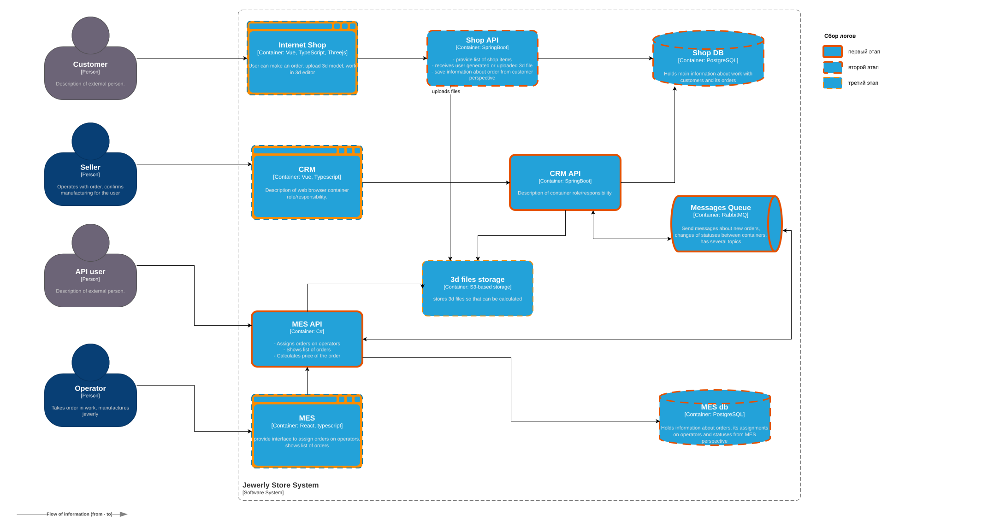
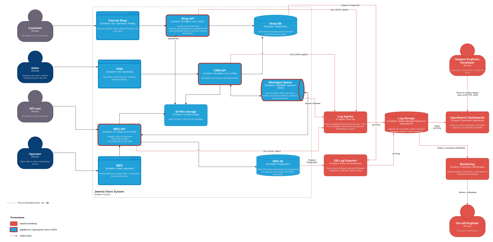

# Архитектурное решение по логированию

## Анализ системы

Сейчас централизованных логов нет. Каждое приложение пишет логи на своей виртуальной машине, и чтобы понять, что случилось с заказом, разработчик заходит на несколько машин и сопоставляет записи вручную. Заказ проходит через три приложения и RabbitMQ, поэтому логи нужны со всех систем на пути заказа, в едином формате и с общими полями: номер заказа и trace_id.

Системы, из которых собираются логи, отмечены на схеме. Этапы подключения описаны в разделе «Очерёдность внедрения логирования и трейсинга».

Исходник: [task4-logging-scope.drawio](task4-logging-scope.drawio)



### Какие логи собирать

| Система | Логи |
| :- | :- |
| MES API | Бизнес-события заказа, приём заказов партнёров, расчёт стоимости, публикация и обработка сообщений, итоги HTTP-запросов, ошибки |
| CRM API | Бизнес-события заказа, передача заказов магазина в MES, создание заказов партнёров, подтверждение и закрытие заказов, публикация и обработка сообщений, сверка MES и CRM, итоги HTTP-запросов, ошибки |
| Shop API | Создание и оформление заказов, загрузка моделей, итоги HTTP-запросов, ошибки |
| RabbitMQ | Журнал брокера: подключения и отключения клиентов, создание и удаление очередей, алармы памяти и диска, ошибки |
| Shop DB, MES db | Журналы Managed PostgreSQL: ошибки, медленные запросы дольше 1 секунды, ожидание блокировок, deadlock |
| Internet Shop, CRM, MES | Ошибки JavaScript и неудачные запросы к API в браузере |
| 3d files storage | Журнал доступа к бакету: кто и когда загружал и читал модели |

### Логи уровня INFO

Общие поля каждой записи: время в UTC с миллисекундами, уровень, система, окружение, хост, версия приложения, trace_id, span_id, тип события и текст сообщения.

| № | Событие | Система | Что логируем кроме общих полей |
| :-: | :- | :- | :- |
| 1 | Изменение статуса заказа | Та система, в которой меняется статус: Shop API, CRM API, MES API | Номер заказа, идентификатор покупателя или партнёра, канал (магазин, партнёр), предыдущий и новый статус, кто изменил: система, идентификатор продавца или оператора. Для MANUFACTURING_STARTED ещё время ожидания заказа до взятия оператором |
| 2 | Загрузка 3D-модели | Shop API, MES API | Номер заказа, идентификатор покупателя или партнёра, способ (файл, конструктор), размер файла, ключ объекта в хранилище |
| 3 | Приём заказа партнёра | MES API | Идентификатор партнёра, идентификатор запроса, номер заказа у партнёра, номер заказа, размер модели, результат |
| 4 | Начало и окончание расчёта стоимости | MES API | Номер заказа, канал, число полигонов, время ожидания в очереди, длительность расчёта, стоимость, результат |
| 5 | Передача заказа магазина в MES | CRM API | Номер заказа, идентификатор покупателя, идентификатор сообщения |
| 6 | Создание заказа партнёра в CRM | CRM API | Номер заказа, идентификатор партнёра, идентификатор сообщения |
| 7 | Публикация сообщения | CRM API, MES API | Идентификатор и тип сообщения, exchange, routing key, номер заказа |
| 8 | Обработка сообщения | CRM API, MES API | Идентификатор и тип сообщения, очередь, номер заказа, номер попытки, длительность, результат |
| 9 | Итог HTTP-запроса | Shop API, CRM API, MES API | Метод, маршрут, код ответа, длительность, клиент (магазин, CRM, MES, партнёр), идентификатор партнёра, внутренний идентификатор пользователя, размер запроса и ответа |
| 10 | Результат сверки MES и CRM | CRM API | Сколько заказов проверено, сколько не найдено в CRM или MES, сколько со статусом, который не совпадает, сколько событий отправлено повторно |
| 11 | Запуск и остановка приложения | Shop API, CRM API, MES API | Версия, профиль, параметры конфигурации без секретов |
| 12 | Подключение клиента, создание и удаление очереди | RabbitMQ | Имя клиента, vhost, очередь |

Пример записи:

```json
{"timestamp":"2026-09-30T13:48:07.530Z","level":"INFO","service":"mes-api","env":"prod","host":"mes-api-1","version":"2.14.0","trace_id":"8f9ffee978c5f6124d812295a2f8722b","span_id":"1a2b3c4d5e6f7081","event":"order.status_changed","message":"Order status changed","order_id":"104512","customer_id":"58231","channel":"shop","previous_status":"MANUFACTURING_APPROVED","status":"MANUFACTURING_STARTED","actor":"operator:117"}
```

### Другие уровни логирования

| Уровень | Когда используется | Примеры | Сбор в prod |
| :- | :- | :- | :- |
| FATAL (Critical в .NET) | Приложение не может продолжать работу | Не прочитана конфигурация, нет подключения к базе или брокеру при запуске | Всегда, звонок дежурному |
| ERROR | Операция не выполнена, нужна реакция | Необработанное исключение, заказ не сохранён, сообщение ушло в DLX, расчёт завершился ошибкой, база или брокер недоступны, ответ 5xx | Всегда, алерты |
| WARN | Отклонение, которое система обработала сама | Повторная доставка сообщения, дубль отброшен по идемпотентности, расчёт дольше 30 минут, партнёр упёрся в лимит запросов, запрос к базе дольше 1 секунды, пул подключений занят больше чем на 80% | Всегда, алерты по росту числа записей |
| INFO | Бизнес-события и итоги запросов | Список выше | Всегда |
| DEBUG | Подробности для разбора конкретной проблемы | Параметры вызовов без персональных данных, SQL-запросы, промежуточные шаги расчёта | В dev и release всегда. В prod включается для одной системы без перезапуска на время разбора, не дольше 24 часов, хранится 3 дня |
| TRACE | Не используется | Пошаговую картину выполнения даёт трейсинг | Не собирается |

## Мотивация

Сейчас ошибки разбираются со слов клиента. Разработчик ищет записи на нескольких машинах, не знает, какие из них относятся к заказу, а часть логов уже удалена ротацией. Централизованные логи с номером заказа и trace_id позволяют найти всю историю заказа одним поиском, увидеть текст ошибки и контекст, в котором она произошла. Поддержка отвечает на типовые вопросы сама, без разработчиков, а ошибки становятся видны до обращения клиента.

| Метрика | Тип | Как изменится |
| :- | :- | :- |
| Время разбора обращения клиента или партнёра | Бизнес | С дней до минут: поддержка находит историю заказа по номеру |
| Доля обращений, которые поддержка закрывает без разработчиков | Бизнес | Растёт: типовые вопросы о статусе и причине задержки закрываются по логам |
| Число споров о вознаграждении операторов | Бизнес | Снижается: журнал хранит, кто и когда взял заказ |
| Время восстановления после сбоя (MTTR) | Техническая | Снижается: текст ошибки, система и заказ видны сразу |
| Доля ошибок, о которых узнали из алертов, а не от клиентов | Техническая | Растёт: алерты по ERROR и аномалиям срабатывают в течение минут |
| Число повторяющихся инцидентов с неустановленной причиной | Техническая | Снижается: причина находится по логам и исправляется |

### Очерёдность внедрения логирования и трейсинга

| Этап | Системы | Почему |
| :-: | :- | :- |
| 1 | MES API, CRM API, RabbitMQ | Заказы партнёров теряются между MES и CRM, и компания уже потеряла на этом контракты. Сообщение можно проследить, только если видны обе стороны обмена, поэтому MES API и CRM API подключаются вместе, логи и трейсинг сразу. В MES сосредоточены и остальные проблемы: расчёт стоимости и медленный дашборд. Журнал RabbitMQ почти ничего не стоит: нужны только настройка формата и агент на машине брокера |
| 2 | Shop API, Shop DB, MES db | Путь заказа в магазине короткий, жалобы в основном на то, что происходит после оформления. Трейсинг Shop API включается Java-агентом без изменения кода, поэтому его можно подключить уже на первом этапе вместе с CRM API. Бизнес-события магазина и журналы баз нужны для разбора медленного дашборда и ошибок записи |
| 3 | Internet Shop, CRM, MES, 3d files storage | Ошибки в браузере и журнал доступа к моделям. Для браузера нужен отдельный защищённый приём данных из интернета, а журнал хранилища нужен прежде всего для аудита безопасности, а не для поиска зависших заказов |

## Предлагаемое решение

### Компоненты

| Компонент | Что сделать |
| :- | :- |
| Shop API, CRM API | Перевести Logback на формат JSON (logstash-logback-encoder), писать в файл с ротацией. trace_id и span_id подставляет OpenTelemetry Java agent из задания 3. Добавить бизнес-события из списка INFO |
| MES API | Подключить Serilog с JSON-форматом и записью в файл, trace_id и span_id берутся из текущего Activity. Добавить бизнес-события |
| RabbitMQ | Включить журнал в формате JSON в файле |
| Log Agents | Fluent Bit на каждой виртуальной машине приложений и брокера. Читает файлы логов, добавляет окружение и хост, удаляет и маскирует чувствительные данные, буферизует на диске на время недоступности хранилища, отправляет в OpenSearch по HTTPS |
| DB Log Exporter | Задача на Python раз в минуту забирает журналы Managed PostgreSQL через API Yandex Cloud и отправляет в OpenSearch. В кластерах баз включается запись медленных запросов дольше 1 секунды и ожиданий блокировок |
| Log Storage | Yandex Managed Service for OpenSearch, тот же сервис, что для трейсов из задания 3, но отдельные индексы. Шаблоны индексов с явной схемой полей, политики хранения, снимки в Object Storage |
| OpenSearch Dashboards | Поиск по логам, сохранённые поиски для поддержки («история заказа по номеру»), дашборды, переход из записи в Jaeger по trace_id |
| Monitoring | Алерты и аномалии из OpenSearch приходят вебхуком в Alertmanager из задания 2. Дежурный получает оповещения по логам и метрикам через один маршрут |

### Схема

Исходник: [task4-logging-containers.drawio](task4-logging-containers.drawio)



### Политика безопасности

Чувствительные данные:

- в логи не пишутся Ф. И. О., email, телефон и адрес покупателя, платёжные данные, пароли, токены, ключи API партнёров, содержимое 3D-моделей, тела запросов и ответов. Вместо персональных данных пишутся внутренние идентификаторы: номер заказа, идентификатор покупателя, партнёра, продавца, оператора;
- заголовки Authorization, Cookie и ключ API удаляются из записей на уровне приложения, параметры запросов в URL не логируются;
- Fluent Bit дополнительно маскирует значения, похожие на email, телефон и номер карты, если они попали в запись по ошибке. Такие случаи попадают в отчёт и исправляются в коде;
- логи хранятся в Yandex Cloud в России. Если в логе всё же окажутся персональные данные, их хранение соответствует 152-ФЗ, а срок хранения ограничен политикой.

Доступ к логам:

| Роль | Доступ |
| :- | :- |
| Поддержка | Чтение логов prod через сохранённые поиски и дашборды, поиск по номеру заказа |
| Разработчики | Чтение логов dev и release полностью, логов prod своих систем. Журналы аудита недоступны |
| Дежурный инженер, DevOps | Чтение всех технических логов, управление индексами и политиками хранения |
| Тимлид | Чтение журналов аудита и журнала доступа к логам |
| Продакт-менеджер, менеджеры по продажам | Только дашборды с агрегатами, без доступа к отдельным записям |
| Fluent Bit, DB Log Exporter | Только запись, каждый в свои индексы |

Вход в OpenSearch Dashboards только через SSO по корпоративной учётной записи, роли назначаются по группам каталога. Изменять и удалять записи вручную не может никто, индексы удаляются только политикой хранения. OpenSearch и Dashboards доступны только из приватной сети и VPN, все соединения по TLS. Журнал аудита OpenSearch записывает, кто и что искал в логах.

### Политика хранения

Под каждую систему и окружение заводится отдельный индекс по дням: `logs-<окружение>-<система>-<дата>`. У систем разный объём, срок хранения и круг доступа, отдельные индексы позволяют настроить это независимо и удалять старые данные целым индексом. Бизнес-события заказа и запросы партнёров дополнительно пишутся в индексы аудита, где хранятся дольше: по ним решаются споры о вознаграждении операторов и претензии партнёров.

Оценка объёма сделана по текущей нагрузке: около 300 тысяч запросов в день к Shop API, 50 тысяч к CRM API, 250 тысяч к MES API, из них 100 тысяч от партнёров, средняя запись 0,5 КБ. Объём указан с учётом реплики и служебных данных индекса.

| Индекс | Содержимое | Срок хранения | Объём в день | Объём за срок |
| :- | :- | :- | :- | :- |
| `logs-prod-shop-api-*` | Логи Shop API | 30 дней | 0,5 ГБ | 15 ГБ |
| `logs-prod-crm-api-*` | Логи CRM API | 30 дней | 0,12 ГБ | 3,6 ГБ |
| `logs-prod-mes-api-*` | Логи MES API, кроме запросов партнёров | 30 дней | 0,35 ГБ | 10,5 ГБ |
| `logs-prod-rabbitmq-*` | Журнал брокера | 14 дней | 0,03 ГБ | 0,4 ГБ |
| `logs-prod-postgresql-*` | Журналы Shop DB и MES db | 14 дней | 0,1 ГБ | 1,4 ГБ |
| `audit-prod-orders-*` | Изменения статусов, подтверждения, взятие заказов операторами | 1 год: 90 дней в кластере, затем в снимках | 0,01 ГБ | 0,9 ГБ в кластере |
| `audit-prod-partner-api-*` | Итоги запросов партнёров | 1 год: 90 дней в кластере, затем в снимках | 0,12 ГБ | 11 ГБ в кластере |
| `logs-prod-debug-*` | Записи DEBUG, пока отладка включена для одной из систем | 3 дня | до 1 ГБ | до 3 ГБ |
| `logs-dev-*`, `logs-release-*` | Логи тестовых окружений | 7 дней | 0,2 ГБ | 1,4 ГБ |

Всего в кластере около 45 ГБ логов, до 3 ГБ отладочных записей и несколько гигабайт трейсов. С запасом на двукратный рост нагрузки и на свободное место, которое нужно OpenSearch для работы, закладывается кластер из трёх узлов по 100 ГБ. Технические логи хранятся 30 дней: заказ должен выполняться за три недели, и этого срока хватает, чтобы разобрать любое обращение по нему. Сроки, ротация индексов и перенос в снимки настраиваются политиками ISM. Снимки хранятся в бакете Object Storage и восстанавливаются в отдельный индекс, если нужен разбор старого случая.

### Анализ логов

Сбор логов становится системой анализа, когда логи сами сообщают о проблемах. Для этого настраиваются алерты по известным признакам и поиск аномалий для того, что заранее не описать правилом.

**Алерты** настраиваются в плагине Alerting OpenSearch и отправляются в Alertmanager:

| Алерт | Условие | Кому |
| :- | :- | :- |
| Сбой приложения | Любая запись FATAL | Звонок дежурному |
| Всплеск ошибок | Записей ERROR в системе больше 20 за 5 минут, или записей ERROR и WARN в три раза больше, чем в среднем за последний час | Дежурному |
| Сообщение в DLX, заказ партнёра не создан | Любая запись о переносе сообщения в DLX или об ошибке создания заказа партнёра | Дежурному |
| Ошибки расчёта стоимости | Три ошибки расчёта за 10 минут | Дежурному и C#-разработчику |
| Система замолчала | Нет записей от системы 5 минут | Дежурному |
| Ошибки брокера и баз | Аларм памяти или диска RabbitMQ, deadlock, отказ в подключении из-за лимита подключений | Дежурному |
| Подбор доступа | Больше 50 ответов 401 и 403 на один адрес или ключ API за 5 минут | Дежурному и тимлиду |

**Поиск аномалий** настраивается в плагине Anomaly Detection OpenSearch. Детекторы обучаются на истории данных, поэтому обычные колебания нагрузки в течение дня аномалией не считаются, а резкий выход за привычный диапазон считается.

| Детектор | Что считает | Что происходит при аномалии |
| :- | :- | :- |
| Поток заказов | Число созданных заказов в минуту по каналу и партнёру | Резкий рост, например с четырёх заказов до 10 000 за секунду, уходит дежурному и менеджеру партнёра. Если источник не партнёр с договором, на балансировщике включается ограничение запросов с этих адресов, адреса проверяются на атаку |
| Запросы к API | Число запросов в минуту по маршруту и адресу клиента | Признак DDoS или парсинга каталога: оповещение дежурному, ограничение и блокировка адресов в Smart Web Security |
| Ошибки | Доля ответов 4xx и 5xx по системе и по партнёру | Рост ошибок у одного партнёра означает проблему интеграции на его стороне, у всех партнёров сразу проблему на стороне «Александрита» |
| Расчёт стоимости | Длительность и число расчётов | Время растёт без роста сложности моделей: не хватает ресурсов MES |
| Действия операторов | Число взятых заказов на оператора в час | Аномально много: возможно, заказы забирает скрипт ради вознаграждения. Оповещение старшему оператору |

Логи дополняют, а не заменяют защиту: ограничения запросов на входе срабатывают сразу, а детектор находит атаку за минуты и помогает понять, откуда она идёт.

Кроме алертов, в OpenSearch Dashboards настраиваются дашборды «Заказы» (события по статусам и каналам), «Ошибки» (по системам и типам) и «Партнёры» (запросы, ошибки, отказы по лимиту). Раз в неделю команда разбирает самые частые ошибки и заводит задачи на исправление.

### Выбор технологии

| Критерий | ELK | OpenSearch | Splunk | Grafana Loki |
| :- | :- | :- | :- | :- |
| Лицензия и стоимость ПО | Elastic License 2.0, SSPL или AGPLv3. Поиск аномалий, SSO, доступ к отдельным полям и аудит только в платной подписке | Apache License 2.0, все функции бесплатны | Проприетарная, оплата за объём данных в день, дорого | AGPLv3, бесплатно |
| Доступность в России | Продажи и поддержка прекращены, управляемый сервис в Yandex Cloud закрыт | Yandex Managed Service for OpenSearch, данные хранятся в России | Продажи и поддержка прекращены | Только самостоятельная установка |
| Поиск по содержимому | Полнотекстовый поиск и агрегации | Полнотекстовый поиск, агрегации, SQL и PPL | Язык SPL, самый мощный из четырёх | Индексируются только метки, поиск по тексту перебором, на больших периодах медленно |
| Алертинг | Есть, часть каналов оповещения платная | Плагин Alerting, вебхуки в Alertmanager | Есть | Правила Loki Ruler в Alertmanager |
| Поиск аномалий | Только в платной подписке | Плагин Anomaly Detection | Machine Learning Toolkit | Нет, только пороговые правила |
| Разграничение доступа и аудит | Базовые роли бесплатно, остальное платно | Роли, доступ к индексам, документам и полям, маскирование полей, журнал аудита, SSO | Роли, SSO, аудит | Разделение по тенантам, детальные права только в платной версии |
| Стоимость хранения | Высокая: индексируется всё | Высокая: индексируется всё, снижается политиками хранения и снимками | Высокая | Низкая: данные сжатыми блоками в Object Storage |
| Хранилище трейсов Jaeger | Поддерживается | Поддерживается, используется в задании 3 | Нет | Нет, для трейсов нужен отдельный Tempo |
| Нагрузка на команду | Свой кластер, эксплуатирует DevOps | Управляемый сервис, кластер поддерживает Yandex Cloud | Свой кластер | Несколько компонентов, эксплуатирует DevOps |

Выбран OpenSearch. Плюсы: открытая лицензия, в которой бесплатны алерты, поиск аномалий, SSO и детальные права доступа; управляемый сервис в Yandex Cloud, поэтому единственному DevOps-инженеру не нужно эксплуатировать кластер; полнотекстовый поиск по номеру заказа и тексту ошибки; одно хранилище для логов и трейсов Jaeger. Минусы: хранение дороже, чем в Loki, потому что индексируется всё содержимое, и кластер нужно планировать по объёму. Это компенсируется сроками хранения, отдельными индексами и переносом аудита в снимки. Loki дешевле по хранению, но в нём нет поиска аномалий и детальных прав доступа, а поиск по тексту медленнее. ELK и Splunk отпадают из-за недоступности в России и стоимости.
