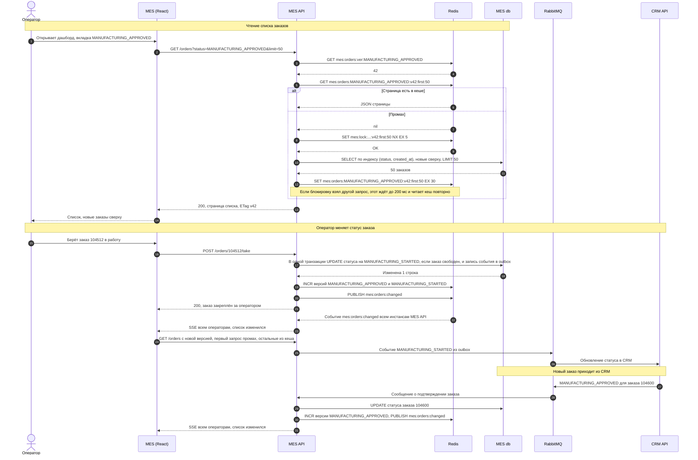
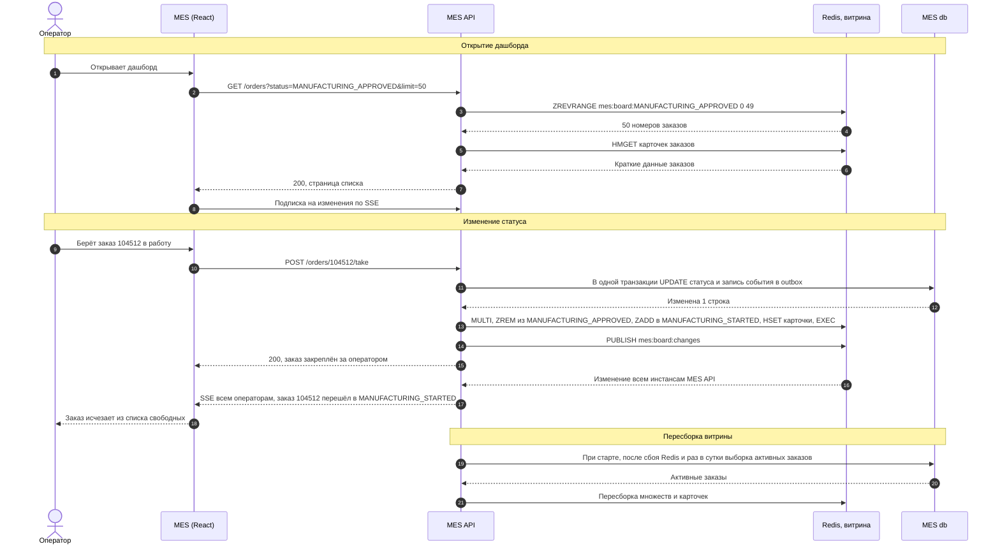

# Архитектурное решение по кешированию

## Анализ системы

Первая страница MES - дашборд со списком заказов в работе по статусам. Список читается из MES db запросом с фильтром по статусу, сортировкой по дате и пагинацией. Все операторы смотрят одни и те же данные и постоянно обновляют страницу, чтобы первыми увидеть новый заказ: кто взял заказ, тот и получит оплату. В это же время MES API считает стоимость и принимает заказы партнёров, а MES db работает в одном экземпляре на чтение и запись.

| Кандидат | Кешировать | Почему |
| :- | :-: | :- |
| Список заказов на дашборде MES | Да | Главная жалоба операторов. Много одинаковых чтений, данные общие для всех операторов, меняются реже, чем читаются |
| Число заказов по статусам на вкладках фильтра | Да | Считается тяжёлым запросом при каждом обновлении страницы |
| Карточка заказа в MES | Нет | Открывается редко, оператор работает по ней, поэтому данные должны быть точными |
| Результат расчёта стоимости | Нет | Стоимость зависит от модели и текущих цен, а долгий расчёт решается выносом в отдельные воркеры. Кеш по хешу модели можно добавить позже, если метрики покажут повторные расчёты одинаковых моделей |
| Статус заказа в API для партнёров | Нет | Партнёру нужен точный статус, а нагрузку от партнёров ограничивают лимиты на шлюзе |
| Каталог магазина | Нет | Жалоб на скорость магазина нет |

## Мотивация

Сейчас каждое обновление страницы каждым оператором выполняет один и тот же тяжёлый запрос. Если на смене 30 операторов и каждый обновляет страницу раз в 10 секунд, база получает 3 одинаковых запроса в секунду, хотя список меняется несколько раз в минуту. Фильтр и пагинация уменьшили объём ответа, но не число запросов и не их стоимость.

Кеширование решает три проблемы:

1. **Медленный дашборд.** Страница отдаётся из памяти за миллисекунды, база выполняет запрос один раз после изменения списка, а не на каждое обновление у каждого оператора.
2. **Нагрузка на MES API и MES db.** Освободившиеся ресурсы уходят на расчёт стоимости и запись статусов, поэтому заказы проходят MES быстрее.
3. **Рост нагрузки.** Нагрузка от дашборда перестаёт расти с числом операторов и частотой обновления страницы.

В кеширование входят MES API (слой кеша при чтении и сброс при записи), новый Redis, фронтенд MES (обновление списка по уведомлению вместо таймера) и MES db, из которой дашборд читает только при промахе. Кеш не заменяет индексы и keyset-пагинацию: при промахе запрос всё равно выполняется и должен быть быстрым.

## Предлагаемое решение

### Клиентское или серверное кеширование

Выбрано серверное кеширование:

- данные общие для всех операторов. Серверный кеш отдаёт одну страницу всем, а клиентский у каждого оператора свой, и первый запрос каждого всё равно идёт в базу;
- список меняется непредсказуемо, а оператору важно увидеть новый заказ сразу. Сбросить кеш в браузере сервер не может, браузер показывает устаревший список до истечения срока, а короткий срок сводит пользу к нулю;
- серверный кеш снимает нагрузку там, где узкое место: с MES db и MES API.

Браузер участвует только в проверке актуальности: MES API отдаёт ETag с версией списка, и если список не изменился, отвечает 304 без тела.

### Паттерн

| Паттерн | Как работает | Для списка заказов |
| :- | :- | :- |
| Cache-Aside | Приложение читает кеш, при промахе читает базу и кладёт результат в кеш. При записи обновляет базу и сбрасывает кеш | Подходит. Кешируются только запрашиваемые страницы, чтение сосредоточено в одном месте кода MES API, при недоступности Redis MES работает с базой напрямую. Минус: после сброса первый запрос идёт в базу, и одновременные запросы могут пойти в базу разом. Это закрывается блокировкой на пересчёт |
| Write-Through | Каждая запись идёт через кеш: приложение синхронно пишет в кеш и в базу | Хуже. Изменение статуса одного заказа меняет сразу несколько списков: убирает заказ из одного статуса, добавляет в другой и сдвигает страницы. Пересчитывать их при каждой записи сложно и дорого, а статусы меняются в нескольких местах кода: действия операторов, сообщения из CRM, результаты расчёта. Ошибка в любом из них оставит в кеше неверный список. Паттерн хорош для отдельных сущностей, а не для выборок |
| Refresh-Ahead | Кеш обновляется заранее, до истечения срока, по расписанию или по частоте обращений | Хуже. Список меняется по событиям, а не по времени. Обновление по таймеру либо показывает новый заказ с задержкой, либо постоянно нагружает базу, даже когда ничего не менялось. Для операторов, которые соревнуются за новые заказы, задержка критична |

Выбран Cache-Aside.

### Как устроен кеш

| Сущность | Ключ в Redis | Что хранит | Срок жизни |
| :- | :- | :- | :- |
| Версия статуса | `mes:orders:ver:<статус>` | Счётчик изменений списка заказов в статусе | Без срока |
| Страница списка | `mes:orders:<статусы>:v<версии>:<курсор>:<размер>` | JSON страницы: номер заказа, дата, статус, канал, сложность модели, срок выполнения | 30 секунд |
| Счётчик по статусу | `mes:orders:count:<статус>:v<версия>` | Число заказов в статусе для вкладки фильтра | 30 секунд |
| Блокировка пересчёта | `mes:lock:<ключ страницы>` | Признак, что страницу уже пересчитывает другой запрос | 5 секунд |
| Канал уведомлений | `mes:orders:changed` | Pub/Sub: какие статусы изменились | Не хранится |

- **Хранилище.** Управляемый кластер Redis в Yandex Cloud: основной узел и реплика. Сохранение на диск не нужно, при нехватке памяти вытесняются давно не использованные ключи. Страниц по 50 заказов и счётчиков немного, всё вместе меньше 100 МБ. Персональных данных в кеше нет.
- **Курсор.** Это дата и номер последнего заказа предыдущей страницы (keyset-пагинация), у первой страницы курсор `first`. Первая страница самая частая: операторам важны новые заказы.
- **Промахи.** При промахе MES API берёт блокировку на ключ командой `SET NX` со сроком 5 секунд. Остальные запросы к этой странице ждут до 200 мс и читают кеш повторно, поэтому база получает один запрос вместо десятков.
- **Отказ Redis.** Таймаут обращения 50 мс. При ошибке MES API читает базу напрямую, а прерыватель цепи не пускает запросы в Redis, пока он недоступен. Дашборд замедляется до текущего уровня, но работает.
- **Уведомление об изменениях.** После сброса MES API публикует событие в канал Redis. Все инстансы MES API получают его и отправляют подключённым операторам SSE-сообщение «список изменился». Фронтенд MES перечитывает список по этому сообщению, а не по таймеру. Первый запрос после изменения идёт в базу, остальные операторы получают страницу из кеша.
- **Взятие заказа.** Защищено базой, а не кешем: статус меняется запросом `UPDATE ... WHERE status = 'MANUFACTURING_APPROVED'`. Даже если оператор видит устаревший список, двое не возьмут один заказ.
- **Метрики.** Доля попаданий, промахи в секунду, время ответа Redis, занятая память и вытеснения собираются вместе с остальными метриками мониторинга.

### Диаграмма последовательности

### Стратегия инвалидации

Используется программная инвалидация по событию изменения с версиями ключей и сроком жизни как страховкой.

При каждом изменении статуса MES API увеличивает версию старого и нового статуса. Версия входит в ключ страницы, поэтому следующий запрос читает уже новый ключ, а старые больше не запрашиваются и удаляются по сроку жизни. Не нужно искать и удалять все страницы и счётчики, где мог оказаться заказ: достаточно одной команды `INCR` на статус. Сброс выполняется в одном месте, в слое доступа к заказам MES, через который проходят все изменения статуса: действия операторов, обработка сообщений из CRM, результаты расчёта. Срок жизни 30 секунд страхует от пропущенного сброса, например если MES API упал между записью в базу и увеличением версии.

| | Временная (TTL) | По ключу | Программная по событию с версиями | Полная очистка |
| :- | :- | :- | :- | :- |
| Как работает | Запись удаляется через заданное время | При изменении заказа удаляются ключи, в которых он есть | При изменении статуса увеличивается его версия, ключи со старой версией больше не читаются | При любом изменении удаляется весь кеш списков |
| Свежесть | Устаревание до срока жизни, новый заказ появляется с задержкой | Сразу, если удалены все нужные ключи | Сразу | Сразу |
| Нагрузка на базу | Короткий срок даёт много промахов, длинный даёт устаревшие данные | Низкая | Низкая: промах только по изменившимся статусам | Выше: после каждого изменения промахи по всем статусам |
| Сложность | Минимальная | Высокая: смена статуса сдвигает все страницы двух статусов, их нужно отслеживать наборами ключей или искать по шаблону | Низкая: одна команда на статус, ключи искать не нужно | Низкая, но удаление по шаблону в Redis медленное |
| Вывод | Не подходит как основная: операторам нужен новый заказ сразу. Используется как страховка | Хуже: сложнее при той же свежести | Выбрана | Хуже: сбрасывает и те статусы, которые не менялись |

### Варианты решения

**Решение 1: Cache-Aside.** Описано выше: страницы списка кешируются при чтении, при изменении статуса увеличивается версия, операторы получают уведомление и перечитывают список, первый запрос после изменения идёт в базу.

**Решение 2: витрина дашборда в Redis.** MES API хранит в Redis готовую витрину активных заказов: отсортированное множество номеров заказов для каждого статуса и краткую карточку каждого заказа. При изменении статуса MES API после записи в базу сразу переносит заказ между множествами и отправляет операторам по SSE само изменение. Дашборд читается только из Redis, база нужна только для пересборки витрины: при старте, после сбоя Redis и раз в сутки для сверки.

| | Решение 1: Cache-Aside | Решение 2: витрина в Redis |
| :- | :- | :- |
| Описание | Страницы списка кешируются при чтении, инвалидация по версиям статусов, уведомление операторов по SSE. Диаграмма в разделе «Диаграмма последовательности» | Готовая витрина активных заказов в Redis обновляется при каждом изменении статуса, изменения приходят операторам по SSE. Диаграмма выше |
| Плюсы | Небольшая доработка: слой кеша при чтении и сброс версии при записи. При отказе Redis MES работает с базой, как сейчас. Кешируются только запрашиваемые данные. Устаревшее значение живёт не дольше 30 секунд | Промахов нет, дашборд не читает базу совсем. Оператор получает изменение без повторного запроса. Нет всплеска запросов после изменения |
| Минусы | После каждого изменения один запрос к базе на страницу. Операторы после уведомления перечитывают список | Витрину нужно обновлять на всех путях изменения статуса, пропущенное обновление даёт неверный список до сверки. Нужны пересборка и сверка с базой. Redis становится источником данных для дашборда, и его отказ останавливает дашборд до пересборки. Все активные заказы хранятся в памяти |
| Трудоёмкость | 1-2 спринта C#-разработчика и доработка фронтенда MES | 3-4 спринта C#-разработчика и доработка фронтенда MES |
| Нагрузка на MES db от дашборда | Один запрос на страницу после изменения статуса | Только пересборка витрины |

Выбрано решение 1. Оно снимает почти всю нагрузку дашборда с базы, внедряется за один-два спринта единственным C#-разработчиком, мало меняет код MES и не делает дашборд зависимым от Redis. Решение 2 быстрее и полностью убирает чтения из базы, но требует безошибочно обновлять витрину на всех путях изменения статуса и держать механизм пересборки. Оно имеет смысл следующим шагом, если метрики покажут, что после внедрения решения 1 промахов после изменений всё ещё много, например при кратном росте числа операторов.
